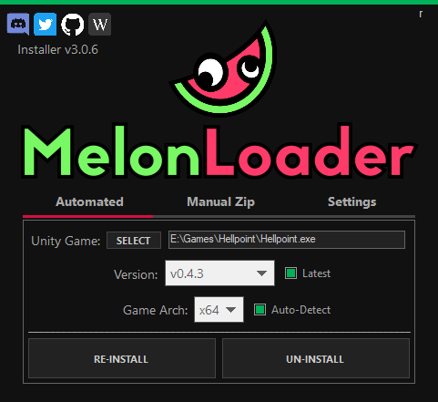
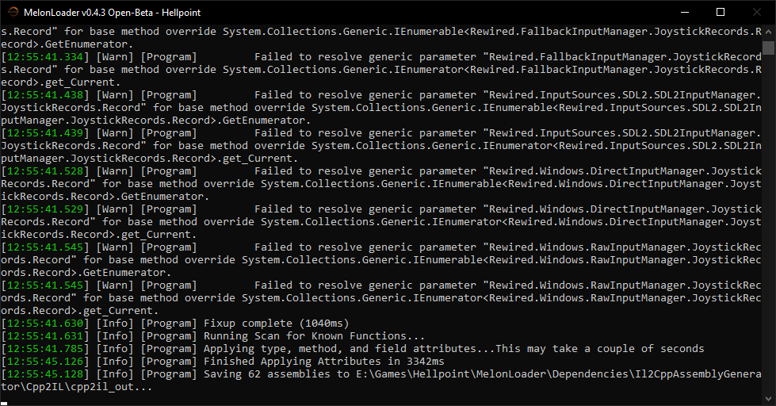
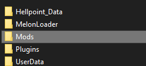
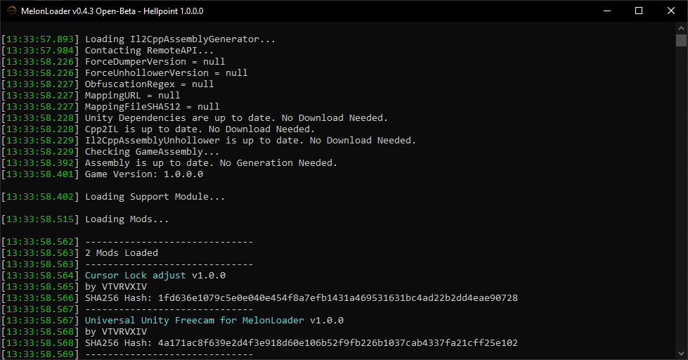

<iframe width="560" height="315" src="https://www.youtube.com/embed/lpUcGNLmdig" title="YouTube video player" frameborder="0" allow="accelerometer; autoplay; clipboard-write; encrypted-media; gyroscope; picture-in-picture" allowfullscreen></iframe>

How to install and use the Universal Unity Freecam
=========
 
The [Universal Unity Freecam](https://youtu.be/I6igj-u1qlk) (UUF) project by [VTVRVXIV](https://twitter.com/vtvrvxiv) adds a freecam to most Unity games. It's a plugin designed to be installed using Unity plugin loaders like MelonLoader and BepInEx, and works in both Unity backends: Mono and IL2CPP.
 
*If you're curious, [this article](https://learn.unity.com/tutorial/memory-management-in-unity#5c7f8528edbc2a002053b59b) covers the difference between the two types. Basically a difference in scripting.*

 
## Installation
 
Before installing you would want to check if your game is Mono or IL2CPP.
Somewhere in the installation directory, Mono has a folder called `Managed`. While IL2CPP has `l2cpp_data`.
 
If the game is on steam you can check the file structure before downloading by going to the [SteamDB](https://steamdb.info) page of the game, `Depots` section and from the table in there click the ID number on the games depot (usually the one with the bigger file size).
 
Once you identified the type of unity backend the game uses, go to the video linked above, download the file according to the backend type from the links in the video description and follow the section of the corresponding type.
 
## Installation - Mono: BepInEx
 
[BepInEx](https://github.com/BepInEx/BepInEx) doesn't come with an installer and you will need to check what version you need to install. This process is for Unity Mono games.
 
* Launch the game and use the Task Manager to check if your game is 32-bit or 64-bit (if it is 32-bit it will have "32 bit" next to the program name).  
{.shadowed .autosize}
 
* Close the game. If it's 32-bit, copy the content from BepInEx_x86.zip into the game's installation folder (specifically in the same folder as the games .exe), or the content from BepInEx_x64.zip if it's 64-bit.
* Start the game again.
 
    @alert important
    **Your game may crash at startup** here, but that's OK. You'll be closing it again anyway.
    @end
 
* Close the game and look inside the `BepInEx` folder. You should see that new folders were created.  
* Open `LogOutput.log` and check for a line that gives you the Unity version of the game, like
`[Info   :   BepInEx] Running under Unity v2019.1.10.15730669`  
* Note down the version, then open the config folder and edit the `BepInEx.cfg` file.  
* In the `[Preloader.Entrypoint]` section change `Type` to what their corresponding Unity version pints out in the table below:  
 
    Version | Change to
    -- | --
    Unity 2017 and above | `Type = MonoBehaviour`
    Unity 5 | `Type = MonoBehaviour`   or   `Type = Camera`
    Unity 4 | `Type = MonoBehaviour`
 
    @alert important
    For Unity 4 games, `System.dll` and `System.Core.dll` must be present in `<Game Name>_Data/ Managed`. If not, you will have to download an old Unity 5 build as a middle ground and export   the 2 files from the Unity Editor.
    @end
    @alert info
    While you are editing the `BepInEx.cfg` file you can also enable console logging under `    [Logging.Console]` by changing `Enabled` to `true`.
    @end
 
* Start the game and confirm it's not crashing or hanging. If it is, you might need to redo the BepInEx process above. Close the game again.  
 
 
* Install the plugins you want by copying them into the `BepInEx\plugins` folder.  
 
    - **vtrvrxiv.freecamplugin.dll**
        - The freecam compatibility section is very important. Many games require fiddling with the mouse hacksection for these inputs to be detected.
        - There is a special section that defines hotkeys for moving the on screen camera menu with the arrow keys. This is a last resort for games that completely prevent mouse movement. You would need to use the arrow keys to move the feature you want to toggle to the center of the screen and then mouse click on it.
 
    - **vtrvrxiv.CursorMode.dll / vtrvrxiv.CursorMode_obsolete.dll**
        - Provides options for making the mouse cursor visible and unlocking it. Some games lock the cursor to the center of the screen which prevents it from interacting with the camera menu.
        - The plugin is not recommended for general use and should only be used if you experience the issue mentioned above.
 
    - **vtrvrxiv.TimeScaleController.dll**
        - Can slow down or speed up game time.
        - Depending on the game can cause extreme frame rate issues.
 
    - **vtrvrxiv.ScreenshotTool.dll / vtrvrxiv.ScreenshotTool_obsolete.dll**
        - Can take screenshots at resolutions up to 16x the current resolution.
        - Generally if the gameData/Managed folder contains a "UnityEngine.ScreenCaptureModule.dll" file use the normal version of the plugin, otherwise try using the "_obsolete" version of the plugin.
        - Screenshots will be saved in the game's "GameName_Data" folder located in the same folder as the exe.
        - Be aware that high resolutions might break some game elements, like postprocessing effects.
        - Keep in mind that postprocessing effects like ReShade won't be shown in shots taken with this plugin. Do however take in mind that almost all unity games can be hotsampled to custom aspect ratios, so you can hotsample the game instead of using this plugin, specially if you want to use reshade in your shots.
       
    - **vtrvrxiv.sceneselect.dll**
        - Loads Unity game scenes found in the scene manager. Scenes usually aren't meant to load this way so it's common for problems to occur.
        - Will likely cause crashes on older games released before the scene management was implemented in Unity.
 
    - [**Configuration manager**](https://github.com/BepInEx/BepInEx.ConfigurationManager/releases)
        - Optional but useful plugin for configuring others plugins hotkeys and options without restarting the game. The menu to do so can be opened by pressing `F1`.
        - As explained below, if you run into troubles like black screen at startup try deleting this plugin from the plugins folder.
 
    If there are multiple versions of a plugin only use one at a time. The `_obsolete` plugins are for games running on older versions of Unity.
 
    @alert info
    It is possible for any plugin to cause game crashes so it is best to test them one at a time.
    @end
 
* Start the game and confirm that the camera is installed by pressing `Backspace`.  
 
#### Configuring the plugin
 
Each DLL installed has its own CFG file that can be found in `BepInEx/Config`, allowing you to change the hotkeys to your own needs. Alternatively you can use the `Configuration Manager` plugin to configure plugins in real time.
 
## Installation - IL2CPP: MelonLoader
 
Unfortunately at the time of writing the IL2CPP version of the freecam is limited compared to its mono counterpart (for example, it doesn't have FoV control). You might be able to find alternatives for these missing features with the Unity Explorer, more on that later.
 
[MelonLoader](https://melonwiki.xyz/#/) comes with an installer to make the installation process quicker and easier. This covers installing the UUF into Unity IL2CPP games.
 
* Launch `MelonLoader.Installer.exe` and select your game's EXE  
{.shadowed .autosize}
 
* Click on INSTALL (or RE-INSTALL if you are upgrading from a previous version)  
* A success popup should appear if the installation has been successful.  
* Upon launching the game, a new window with a console will open on your screen. A process called the unhollowing will start. Wait until MelonLoader is done unhollowing. **This process requires an internet connection.**  
{.shadowed .autosize}  
 
* Close your game and go to your game's installation folder.  
 
* If `MelonLoader/Managed` has `UnityEngine.InputLegacyModule.dll`, copy over `MelonLoader_Freecam_LegacyInput.dll` into the new `mods` folder created by MelonLoader. Otherwise, copy over `MelonLoader_Freecam.dll`.
{.shadowed .autosize}  
 
 
* Start the game and the freecam should be successfully loaded in!  
{.shadowed .autosize}  
 
 
## Mono Default Camera Controls
 
Keybind | Description
-- | --
`Backspace` |Open / Close the camera menu
`Z` | Rest camera to default (hold when clicking on camera)
`i` | Move camera forward
`k` | Move camera backward
`j` | Move camera left
`l` | Move camera right
`o` | Move camera up
`u` | Move camera down
`NumPad 8` | Rotate camera forward
`NumPad 2` | Rotate camera backward
`NumPad 4` | Rotate camera left
`NumPad 6` | Rotate camera right
`NumPad 9` | Rotate camera up
`NumPad 7` | Rotate camera down
`Left Control` | Slow down the camera movement
`Left Shift` | Speed up the camera movement
 
@alert important
When in the camera menu, and before activating the free camera, it's important to disable the Cinemachine one! Without that, you won't be able to use the freecam.
@end
 
As an extra, if you install the `vtrvrxiv.TimeScaleController.dll` plugin, the default hotkey for pausing would be the `Pause` key, above the `Page up` key. Alternatively you can also pause in the Configuration Menu if you have that plugin installed or pause it with an Unity inspector plugin, more on that in the [HUD toggle and more](universal_unity_freecam.htm#hud-toggle-and-more) section.
 
 
## IL2CPP Default Camera Controls
 
Keybind | Description
-- | --
`F9` | Open / Close the camera menu
`F10` | Open the Mono camera behaviour (press and hold F10 while clicking on a camera)
`i` | Move camera forward
`k` | Move camera backward
`j` | Move camera left
`l` | Move camera right
`o` | Move camera up
`u` | Move camera down
`F11` | Decrease camera movement speed by a factor of 2
`F12` | Decrease camera movement speed by a factor of 2
 
@alert important
When in the camera menu, and before activating the free camera, it's important to disable the Cinemachine one! Without that, you won't be able to use the freecam.
@end
 
### Configuration
MelonLoader generates a `UserData\MelonPreferences.cfg` file where configuration can be changed.
Supports keybinds, mouse axis inverting, and specify when mouse look on the freecam is activated.
   
When changing keybinds look at the `keycodes.txt` file in the freecam .zip for a list of working key strings. Case sensitive.
   
By default mouseLookEnabler is set to `Always` so mouse look is always on when the freecam is enabled. This can be changed to look on when a mouse button is held by changing the setting to `Left`, `Right`, or `Middle`. Case sensitive.
   
These settings must be changed manually with a text editor. The game must be relaunched after the cfg file is edited.
 
 
 
## HUD toggle and more
 
The UUF does not come with a way to hide HUDs. The best way is through a Unity inspector like [Runtime Unity Editor](https://github.com/ManlyMarco/RuntimeUnityEditor) (Mono) or [Unity Explorer](https://github.com/sinai-dev/UnityExplorer) (Mono/IL2CPP).
 
Besides being able to toggle HUDs these inspectors would allow you to modify a lot of the game objects properties, like moving the position of light sources, turning off postprocessing effects or hiding characters entirely. You may also find the camera in some cases, which is useful when FoV control (or the whole freecamera) isn't supported. This will be expanded in the Advanced section in the future.
 
These unity inspectors also come with a button to change the game's velocity, like the mono plugin explained in the `Mono: BepInEx` section, so it's very handy for IL2CPP games.
 
## Additional tips
 
* Most unity games (if not almost all of them) let you [**hotsample**](https://framedsc.github.io/basics.htm#hotsampling), and even let you use custom ARs.
 
* It's generally recommended to disable any overlays you have as they may conflict with the keybinds above.
 
* The console may not appear when you start the game for the first time. Check the game's installation folder for a file named `version.dll`. Rename it to `winhttp.dll`, or vice versa, depending on the situation.
 
* If the game is using a DRM like steam make sure you are launching said game through steam and not opening the .exe. Some games won't start otherwise and this error might be confused with a problem created while trying to install the tools explained in this guide.
 
* When using the camera menu to select the right camera make sure to include all the items referring to postprocessing effects to make sure those are being shown when moving the camera around.
 
## Troubleshooting
 
* If the cursor is still locked and/or missing after using the `vtrvrxiv.CursorMode.dll` (or `vtrvrxiv.CursorMode_obsolete.dll`) plugin then your last resort is to open the `GAME_Data\Managed\Assembly-CSharp.dll` file with DNSPY and deleting all the lines of code that refer to the cursor. In most games you want to look for lines that have `Cursor.lockState` and `Cursor.visible`, and if the game is old you could try looking for the lines that have `Screen.showCursor` and `Screen.lockCursor` on them.
 
* If you can point the camera upwards, try rotating it 90° and then changing its orientation "to a side" to make it point upwards.
 
## Advanced
 
* Is it right that it's "technically possible" in some IL2CPP games to find and control the fov with a unity inspector? If not then we should delete what I wrote in the "HUD toggle and more" section.
 
* [RuntimeGraphicsSettings](https://github.com/knah/ML-UniversalMods#runtimegraphicssettings): Could be useful for increasing graphic fidelity in some games.
 
 
## More links
 
- [BepInEx Documentation](https://docs.bepinex.dev/master/articles/user_guide/installation/index.html) - Extensive installation, configuration and troubleshooting site
- [MelonLoader Documentation](https://melonwiki.xyz/#/README) - Info about installation, configuration and more