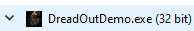

# Title One Example
## Title Two Example
### Title Three Example
Command | Syntax | Description
--|--|--
Vanilla Photo Mode | No |
Hotsampling | Yes |
DSR | Yes |
Custom Aspect Ratios | No |
Reshade | Yes (No depth buffer) |
Ansel | No |
DirectX versions | DirectX 11 | testing!

<iframe width="854 " height="480" src="https://www.youtube.com/embed/lpUcGNLmdig" title="YouTube video player" frameborder="0" allow="accelerometer; autoplay; clipboard-write; encrypted-media; gyroscope; picture-in-picture" allowfullscreen></iframe>

How to install and use the Universal Unity Freecam
=========

## Link to a video with an image

*This is a subtitle, [this article](https://learn.unity.com/tutorial/memory-management-in-unity#5c7f8528edbc2a002053b59b) covers the difference between the two types. Basically a difference in scripting.*

* Launch the game and use the Task Manager to check if your game is 32-bit or 64-bit (if it is 32-bit it will have "32 bit" next to the program name).  
{.shadowed .autosize}
 
* Close the game. If it's 32-bit, copy the content from BepInEx_x86.zip into the game's installation folder (specifically in the same folder as the games .exe), or the content from BepInEx_x64.zip if it's 64-bit.
* Start the game again.
* Close the game and look inside the `BepInEx` folder. You should see that new folders were created.  
* Open `LogOutput.log` and check for a line that gives you the Unity version of the game, like
`[Info   :   BepInEx] Running under Unity v2019.1.10.15730669`  
* Note down the version, then open the config folder and edit the `BepInEx.cfg` file.  
* In the `[Preloader.Entrypoint]` section change `Type` to what their corresponding Unity version pints out in the table below:  

* Install the plugins you want by copying them into the `BepInEx\plugins` folder.  
 
    - **vtrvrxiv.freecamplugin.dll**
        - The freecam compatibility section is very important. Many games require fiddling with the mouse hacksection for these inputs to be detected.
        - There is a special section that defines hotkeys for moving the on screen camera menu with the arrow keys. This is a last resort for games that completely prevent mouse movement. You would need to use the arrow keys to move the feature you want to toggle to the center of the screen and then mouse click on it.
 
    - **vtrvrxiv.CursorMode.dll / vtrvrxiv.CursorMode_obsolete.dll**
        - Provides options for making the mouse cursor visible and unlocking it. Some games lock the cursor to the center of the screen which prevents it from interacting with the camera menu.
        - The plugin is not recommended for general use and should only be used if you experience the issue mentioned above.
 
    - **vtrvrxiv.TimeScaleController.dll**
        - Can slow down or speed up game time.
        - Depending on the game can cause extreme frame rate issues.

## This is a link of useful links
- [BepInEx Documentation](https://docs.bepinex.dev/master/articles/user_guide/installation/index.html) - Extensive installation, configuration and troubleshooting site
- [MelonLoader Documentation](https://melonwiki.xyz/#/README) - Info about installation, configuration and more

## Mono Default Camera Controls
Keybind | Description
-- | --
`Backspace` |Open / Close the camera menu
`Z` | Rest camera to default (hold when clicking on camera)
`i` | Move camera forward
`k` | Move camera backward
`j` | Move camera left
`l` | Move camera right
`o` | Move camera up
`u` | Move camera down
`NumPad 8` | Rotate camera forward
`NumPad 2` | Rotate camera backward
`NumPad 4` | Rotate camera left
`NumPad 6` | Rotate camera right
`NumPad 9` | Rotate camera up
`NumPad 7` | Rotate camera down
`Left Control` | Slow down the camera movement
`Left Shift` | Speed up the camera movement

@tabs
@tab First Tab
This is the text for the first tab. It's nothing special

@alert tip
This is a tip! It will be displayed in a tip alert box!
@end

@alert important
This is an important text, it will be displayed in a warning/important alert box!
@end

@alert info
This is an info text, it will be displayed in an info alert box!
@end

@alert warning
This is a warning text, it will be displayed in a warning alert box!
@end

@alert danger
This is a dangerous text, it will be displayed in a danger alert box!
@end

As you can see, it can deal with newlines as well. 
@end
@tab Second Tab
Now, the second tab however is very interesting. At least let's pretend it is!
@end
@endtabs